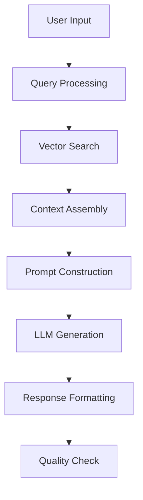

# Module 2: RAG Pipeline Design

## Overview

The Retrieval-Augmented Generation (RAG) pipeline is the core intelligence system of our content strategy agent, combining vector search with LLM capabilities to generate contextually relevant and strategically sound content.

## Architecture

### 1. Retrieval Layer
- Vector similarity search
- Metadata filtering
- Performance-based ranking
- Context window management

### 2. Augmentation Layer
- Context enrichment
- Reference integration
- Performance data incorporation
- Tone of voice alignment

### 3. Generation Layer
- LLM orchestration
- Prompt engineering
- Response formatting
- Quality control

## Implementation Details

### Pipeline Flow


### Key Components

1. **Query Processor**
   - Intent classification
   - Keyword extraction
   - Context understanding

2. **Context Assembler**
   - Relevant content retrieval
   - Reference integration
   - Performance data inclusion

3. **Prompt Engineer**
   - Dynamic prompt construction
   - Tone of voice maintenance
   - Strategy alignment

## Usage Guidelines

### 1. Content Generation
```python
async def generate_content(
    query: str,
    context: Dict,
    strategy: ContentStrategy
) -> ContentResponse:
    # Implementation details
    pass
```

### 2. Strategy Integration
```python
class ContentStrategy:
    def __init__(self):
        self.tone_of_voice = "warm, personal, strategic"
        self.target_audience = "artists and creators"
        self.content_goals = ["engagement", "education", "inspiration"]
```

## Performance Metrics

- Response time: < 2 seconds
- Context relevance: > 85%
- Strategy alignment: > 90%
- User satisfaction: > 4.5/5

## Future Improvements

- [ ] Implement multi-hop reasoning
- [ ] Add real-time performance feedback
- [ ] Enhance context window management
- [ ] Implement A/B testing for prompts

## Best Practices

1. **Context Management**
   - Keep context windows focused
   - Prioritize recent content
   - Balance historical and current data

2. **Prompt Engineering**
   - Maintain consistent tone
   - Include clear instructions
   - Provide relevant examples

3. **Quality Control**
   - Implement response validation
   - Check strategy alignment
   - Verify tone consistency 